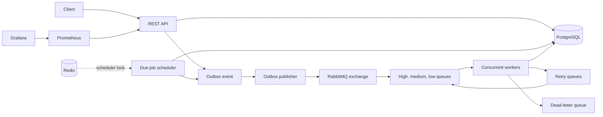
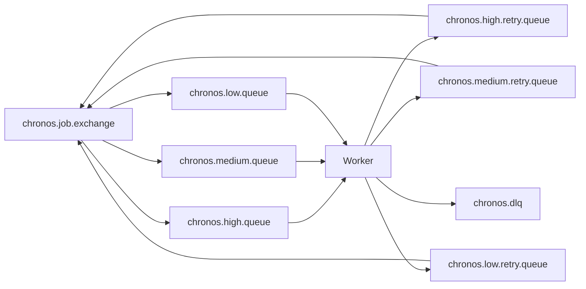

# Chronos Architecture

Chronos is a single Spring Boot application that can run in `api`, `worker`, or `all` mode. PostgreSQL is the source of truth for jobs, execution claims, request idempotency records, and the transactional outbox. RabbitMQ provides asynchronous, at-least-once delivery. Redis coordinates scheduler ticks when available; it never stores job state.

## Job lifecycle

`CREATED` is the initial state. Immediately due jobs receive a `JOB_CREATED` outbox event; future jobs remain `CREATED` until the scheduler finds them due. Publishing moves the message asynchronously through RabbitMQ, and a worker records `RUNNING` after claiming `(jobId, attemptNumber)`. A successful handler ends in `SUCCESS`. A retryable failure becomes `RETRYING`, then returns through a priority-specific retry queue. Exhausted or non-retryable failures end in `DLQ`. A client can cancel any job other than `SUCCESS` or an already `CANCELLED` job. Manual retry is allowed from `FAILED`, `CANCELLED`, and `DLQ`.

## Delivery and idempotency

Delivery is at-least-once, not exactly-once. RabbitMQ can redeliver after a consumer failure. Before invoking the handler, Chronos inserts an execution claim with a unique `(job_id, attempt_number)` constraint. A duplicate that observes an existing claim is acknowledged without invoking the handler again.

There is still a deliberate crash window: a worker can complete an external side effect and die before its database transaction commits. Chronos will eventually retry that attempt. Handlers that interact with external systems therefore need their own idempotency key, normally derived from the Chronos job ID and attempt.

## Scheduling and recovery

The scheduler uses Redis `SET NX` with a short TTL to avoid parallel scheduler ticks across instances. If Redis is unavailable, it continues and relies on PostgreSQL pessimistic locking of due jobs as the correctness backstop. A lease-recovery task finds expired `RUNNING` jobs and writes a new outbox event with the next attempt number, preserving the original execution record.

## RabbitMQ topology

Retry queues use message TTL and dead-letter routing back to the priority queue. The publisher and workers only carry compact routing data in messages; the authoritative payload and status remain in PostgreSQL.
